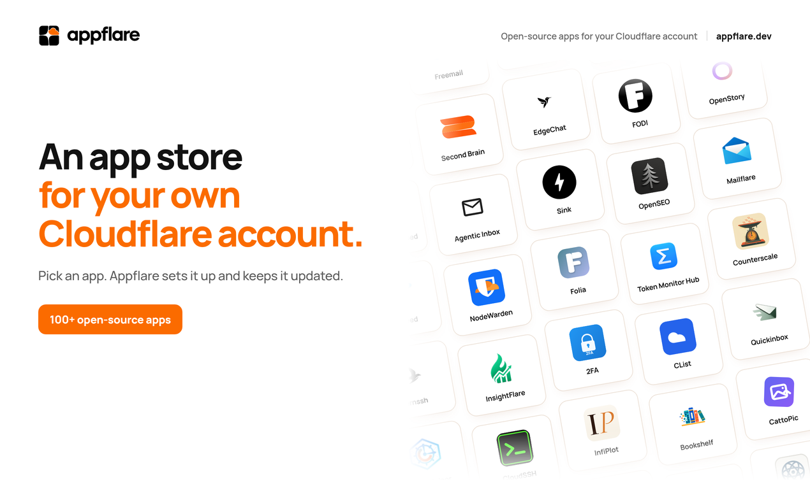

<h1 align="center">
  <picture>
    <source media="(prefers-color-scheme: dark)" srcset="docs/assets/logo_full_white.svg">
    
  </picture>
</h1>

<p align="center"><strong>An app store for your own Cloudflare account.</strong></p>

<p align="center">
  <a href="https://appflare.dev?utm_source=github&utm_medium=readme&utm_campaign=appflare&utm_content=appflare-readme-home-1"></a>
  <a href="https://github.com/appflare/appflare/actions/workflows/ci.yml"></a>
  <a href="LICENSE"></a>
</p>

Install and manage 100+ open-source apps, including [OpenSEO](https://appflare.dev/apps/open-seo/?utm_source=github&utm_medium=readme&utm_campaign=appflare&utm_content=appflare-readme-apps-open-seo-1),
[Sink](https://appflare.dev/apps/sink/?utm_source=github&utm_medium=readme&utm_campaign=appflare&utm_content=appflare-readme-apps-sink-1) and [Counterscale](https://appflare.dev/apps/counterscale/?utm_source=github&utm_medium=readme&utm_campaign=appflare&utm_content=appflare-readme-apps-counterscale-1).
Appflare sets up each app and gives you one dashboard for updates, custom domains
and access control. Your apps run in your own Cloudflare account.

[](https://link.appflare.dev/deploy?utm_source=github&utm_medium=readme&utm_campaign=appflare&utm_content=appflare-readme-install-1)

Or use [Cloudflare's Deploy button](https://link.appflare.dev/deploy-1c?utm_source=github&utm_medium=readme&utm_campaign=appflare&utm_content=appflare-readme-cloudflare-deploy-1).

[Browse the apps](https://appflare.dev/apps/?utm_source=github&utm_medium=readme&utm_campaign=appflare&utm_content=appflare-readme-apps-1) · [Installation guide](https://appflare.dev/start/install/?utm_source=github&utm_medium=readme&utm_campaign=appflare&utm_content=appflare-readme-start-install-1) · [Documentation](https://appflare.dev?utm_source=github&utm_medium=readme&utm_campaign=appflare&utm_content=appflare-readme-home-2) · [App catalog repository](https://github.com/appflare/catalog)

[](https://appflare.dev/apps/?utm_source=github&utm_medium=readme&utm_campaign=appflare&utm_content=appflare-readme-apps-2)

## Install Appflare

Select **Install Appflare** above, sign in to Cloudflare, and choose the account
and address. Appflare's hosted deploy page installs it for you. You need only a
Cloudflare account, with no API token to create or Git repository to clean up.
[The browser setup guide](https://appflare.dev/start/browser-install/?utm_source=github&utm_medium=readme&utm_campaign=appflare&utm_content=appflare-readme-start-browser-install-1) covers each step.

You can also use [Cloudflare's Deploy button](https://link.appflare.dev/deploy-1c?utm_source=github&utm_medium=readme&utm_campaign=appflare&utm_content=appflare-readme-cloudflare-deploy-2),
which copies a repository into your GitHub or GitLab account.
[Its setup guide](https://appflare.dev/start/deploy-button/?utm_source=github&utm_medium=readme&utm_campaign=appflare&utm_content=appflare-readme-start-deploy-button-1) explains the token and cleanup.

Or run the installer with **Node.js 22 or newer**:

```sh
npx create-appflare
```

You can also [give the installation prompt to a coding agent](https://appflare.dev/start/install/?utm_source=github&utm_medium=readme&utm_campaign=appflare&utm_content=appflare-readme-start-install-2).
All these methods install the same Appflare release into your account.

Appflare is free and open source. It runs on the free Workers plan, and most
catalog apps do too. Each app's page shows whether it needs Workers Paid. Apps count
against your own Cloudflare plan, and some use third-party services with their own
pricing.

## What you can do

- Browse apps for analytics, email, files, AI, productivity and more, then install them from your browser.
- Update apps when a new version is available. Automatic updates are off until you turn them on.
- Follow installs and updates in a live log, and roll back to an earlier app version when supported.
- Give apps custom domains and protect them with Cloudflare Access.
- Change app settings, or remove apps along with their resources.

Appflare creates each app's Cloudflare resources, such as databases and storage.
Installed apps don't need Appflare to run, so they keep running if it stops or
you remove it.

## Contribute

[Report a bug or suggest a feature](https://github.com/appflare/appflare/issues),
or open a pull request to improve the manager, installer or documentation.
To add an app, use the [catalog repository](https://github.com/appflare/catalog)
and [submission guide](https://appflare.dev/catalog/submit/?utm_source=github&utm_medium=readme&utm_campaign=appflare&utm_content=appflare-readme-catalog-submit-1).

For development, use Node.js 22 or newer and pnpm 10. The repository's
[`package.json`](package.json) pins the pnpm version.

```sh
git clone https://github.com/appflare/appflare.git
cd appflare
pnpm install --frozen-lockfile
pnpm check
```

The [manager](apps/manager), [installer](packages/cli), [catalog packer](packages/pack)
and [documentation site](apps/docs) live in this repository.

## Documentation

Find setup instructions and guides at [appflare.dev](https://appflare.dev?utm_source=github&utm_medium=readme&utm_campaign=appflare&utm_content=appflare-readme-home-3):

- [What Appflare is](https://appflare.dev/start/overview/?utm_source=github&utm_medium=readme&utm_campaign=appflare&utm_content=appflare-readme-start-overview-1)
- [Install Appflare](https://link.appflare.dev/deploy?utm_source=github&utm_medium=readme&utm_campaign=appflare&utm_content=appflare-readme-install-2)
- [Install an app](https://appflare.dev/guides/install-apps/?utm_source=github&utm_medium=readme&utm_campaign=appflare&utm_content=appflare-readme-guides-install-apps-1)
- [Update and roll back](https://appflare.dev/guides/updates/?utm_source=github&utm_medium=readme&utm_campaign=appflare&utm_content=appflare-readme-guides-updates-1)
- [Custom domains](https://appflare.dev/guides/custom-domains/?utm_source=github&utm_medium=readme&utm_campaign=appflare&utm_content=appflare-readme-guides-custom-domains-1)
- [Submit an app to the catalog](https://appflare.dev/catalog/submit/?utm_source=github&utm_medium=readme&utm_campaign=appflare&utm_content=appflare-readme-catalog-submit-2)
- [Security model](https://appflare.dev/security/?utm_source=github&utm_medium=readme&utm_campaign=appflare&utm_content=appflare-readme-security-1)
- [FAQ](https://appflare.dev/faq/?utm_source=github&utm_medium=readme&utm_campaign=appflare&utm_content=appflare-readme-faq-1)

## License

[Apache-2.0](LICENSE). Catalog apps have their own licenses, shown on their app pages.

Appflare is an independent open-source project and is not affiliated with, endorsed by,
or sponsored by Cloudflare, Inc.
